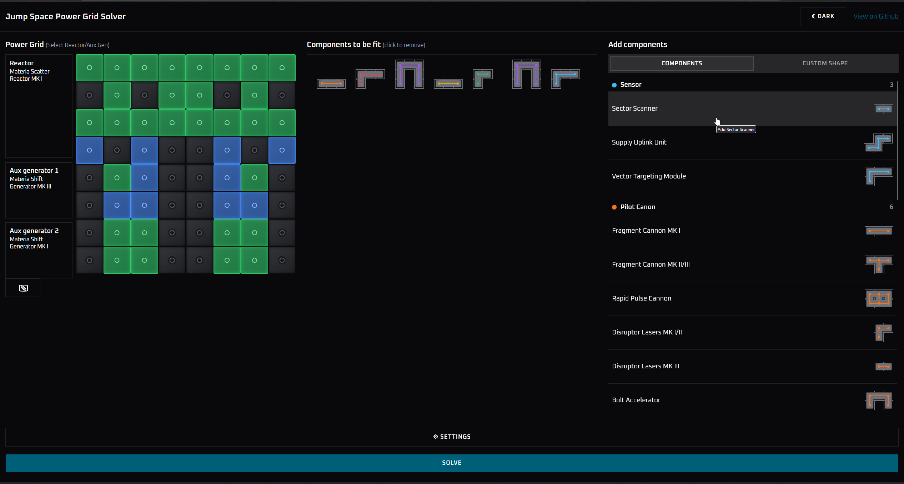

# Jump Space Reactor Solver

🚀 **You can try it here: https://oussamaxx.github.io/jump-space-solver/**

A web app that helps you plan your ship's power grid layout in [Jump Space](https://jumpspacegame.com/) ([Steam](https://store.steampowered.com/app/1757300/Jump_Space/)).

Pick your ship components, then choose a reactor and two aux generators. The generators define the powered/protected cells, and the app finds a tiling that fits your components into them. If everything can't fit, it falls back to a partial solution. You can also draw custom pieces and regions by hand (if ever the project was no longer maintained).

Built with Svelte, Tailwind and shadcn-svelte. Solving runs in a Web Worker.

## How it works

### Algorithm X

Knuth's "Algorithm X" (implemented with "Dancing Links") handles this problem by reducing it to an [Exact Cover Problem](https://en.wikipedia.org/wiki/Exact_cover). The details are explained by Knuth in [his paper](https://arxiv.org/abs/cs/0011047). [dlxlib](https://github.com/taylorjg/dlxlibjs) by [taylorjg](https://github.com/taylorjg) provides the Dancing Links implementation. Despite the name, this method also finds inexact solutions, by adding single-block placeholder pieces to the exact cover problem.

### Legacy methods

Two older, much slower backends are still in the code:

- **SAT**: the tiling is converted to [CNF](https://en.wikipedia.org/wiki/Conjunctive_normal_form) (one variable per possible piece placement, with clauses forcing each piece into exactly one placement and forbidding overlaps) and solved with [boolean-sat](https://www.npmjs.com/package/boolean-sat).
- **Z3**: the problem is converted to [SMT-LIB](http://smtlib.cs.uiowa.edu/) and solved with the [WebAssembly build](https://github.com/cpitclaudel/z3.wasm) of [Z3](https://github.com/Z3Prover/z3).

## Development

- `npm run serve`: dev server with hot reload
- `npm run build`: production build to `dist/`

## Credits

- Based on [polyomino-solver](https://github.com/cemulate/polyomino-solver) by [cemulate](https://github.com/cemulate), including the polyomino editor originally from [web-component-polyomino](https://github.com/cemulate/web-component-polyomino).
- [dlxlib](https://github.com/taylorjg/dlxlibjs) by taylorjg.
- [Jump Space](https://jumpspacegame.com/) by Keepsake Games. This is an unofficial fan tool, not affiliated with the developers.
